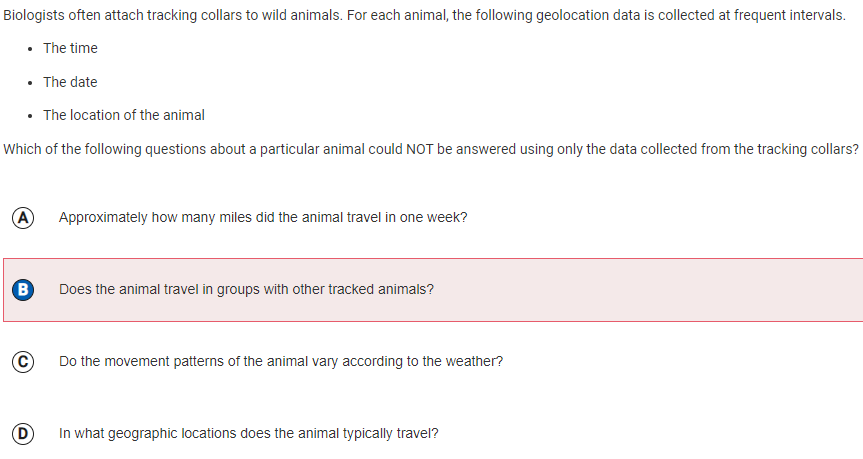

## AP Computer Science Principles Finals-Quiz1

### MCQ and Test Corrections:

Karthik Valluri AP MCQ Practice Test Corrections:

|     |     |
| --- | --- |
|  | Question 2.  My answer:  B  Correct answer:  C  1.  There was no reason for me to get this wrong, this was a complete blunder on my side. 2.  Answer A is correct because about.example.comis subdomain of the domain example.com. 3.  I rushed on this question and just gave a quick glance at it as I deemed it very easy, I have to practice patience on every question. |
|  | Question 3.  My answer:  D  Correct answer:  B  1.  I made a silly mistake and didn’t read the answer choices correctly. 2.  Answer B is correct because analyzing where a photo was taken is very difficult to find out through metadata and using the actual data makes a lot more sense. 3.  I can look through 2.3 and watch the daily videos 1 and 2 to ensure that I have a full understanding and grasp of the topic. |
|  | Question 4.  My answer:  B  Correct answer:  A  1.  Answer A is clearly wrong because the network is considered fault-tolerant because it provides redundant routing. It cannot guarantee that components are foolproof. 2.  Answer D is correct because one way to accomplish network redundancy is by having more than one path between any two connected devices. Redundancy within a network allows it to support failures and still continue to function. 3.  A related question on this quiz was number 34 which could be helpful to take a look at because I got it correct. Daily Videos 1 and 2 from 4.2 also describe this topic and are very useful resources to better understand this. |
|  | Question 9.  My answer:  D  Correct answer:  B  1.  Answer D is incorrect because the upgraded system selects the appropriate department based on the customer’s issue, so the customer does not have the ability to make an incorrect selection. 2.  Answer B is correct since the company is not able to provide a human representative for calls made after business hours. 3.  Topic 5.1’s daily videos are a very useful resource as they are in-depth about this topic. |
|  | Question 13.  My answer:  B  Correct answer:  C  1.  Answer B is incorrect because data on the location of the animal is provided. 2.  Answer B is correct since data about the weather is not provided. 3.  I shouldn’t have got this problem wrong, I have to be more careful looking at the nuances and details of what the question is asking. |
|  | Question 21.  My answer:  B  Correct answer:  C  1.  Answer D is incorrect because it is common knowledge that the internet is not a data stream. 2.  Answer B is correct since the Internet is an interconnected network of networks, and the World Wide Web is an information system that is accessed via the Internet.. 3.  Topic 4.1’s daily videos are a very useful resource as they are in-depth about this topic. |
|  | Question 24.  My answer:  D  Correct answer:  B  1.  I think I should review daily videos 4.1 and do further research on this topic as I am getting far too many questions wrong about something I use everyday, the internet. 2.  Answer B is correct since internet packets are not encrypted and then decrypted. Each packet contains data to be transmitted, along with metadata containing information used for routing the data. |
|  | Question 32.  My answer:  B  Correct answer:  C  1.  I need to be more patient and analyze all the possible answer choices before quickly putting one. 2.  Answer C is correct since you have set the amount of the times that ‘val’ appears to zero before the program starts to get full and proper functionality. 3.  I need to do more practice questions on algorithm types questions like this. I also need practice with CB pseudocode. |
|  | Question 37.  My answer:  C  Correct answer:  D  1.  Answer C is incorrect because the code segment will work with the values provided. 2.  Answer D is correct since the values provided will cause the code segment to fail the task it’s set out to achieve. 3.  Reviewing daily videos is important to practice these algorithmic types of questions. |
|  | Question 39.  My answer:  B  Correct answer:  C  1.  Answer B is wrong because in whatever combination you choose you can never get a time of 70 sec. 2.  Answer C is correct because you can process X(60) and Y(30) and then Y will finish first leaving X with 30 seconds of processing time. Z(50) and X(30 left) will be processed simultaneously. This will take a total of 30 sec + 50 sec = 80 seconds. 3.  This is a simple logic and math question, should not have been a question I got wrong. |
|  | Question 40.  My answer:  D  Correct answer:  C  1.  Answer D is incorrect because requiring every city school to have computers that meet minimum standards would allow all students equal access to computing, and thus it is likely to reduce the digital divide. 2.  Answer C is correct since putting all government forms on the city website is least likely to be effective in reducing the digital divide because all citizens may not have equitable access to the Internet. 3.  Topic 5.2’s daily video #1 is a very useful resource as they are in-depth about this topic. |
|  | Question 41.  My answer:  D  Correct answer:  C  1.  Answer D is incorrect because while removing four links could isolate computer F from computer E, it is not the minimum number required to accomplish this.. 2.  Answer B is correct since any line between two computers represents a way for them to communicate with each other, and a communication between two computers can go through other computers. If the links from F to G, from F to A, and from F to E were broken, it would not be possible for computers E and F to communicate.. 3.  Topic 4.2’s daily videos are a very useful resource as they are in-depth about this topic. |
|  | Question 43.  My answer:  D  Correct answer:  C  1.  Answer D is incorrect because a phishing attack is not an overwhelming amount of messages. 2.  Answer B is correct since it occurs when an attacker, masquerading as a trusted entity, dupes a victim into opening an email, instant message, or text message. 3.  This is a question I should not have gotten wrong as I have experience answering questions about phishing attacks. |
|  | Question 49.  My answer:  D  Correct answer:  B  1.  Answer D is incorrect because by storing Web pages frequently visited by each user, a user’s preferences, interests, or transactions could be monitored. This would have a negative impact on the user’s privacy. 2.  Answer B is correct since the actions of the ISP will only affect how frequently visited pages are loaded into Web browsers. Pages not saved by the ISP are still accessed as they were before. 3.  Topic 2.3’s daily videos are a very useful resource as they are in-depth about this topic. |
|  | Question 50.  My answer:  B  Correct answer:  C  1.  Answer B is incorrect since by converting the red, green, and blue values in each pixel into a single number, information has been lost that cannot be restored. 2.  Answer C is correct because if a negative of the original image is made, each RGB triplet value will be computed by subtracting the original value from 255. The original value can then be restored by subtracting the new value from 255. This process is lossless because the exact original can be restored. 3.  Topic 2.2’s daily video #1 is a very useful resource as they are in-depth about this topic. |
