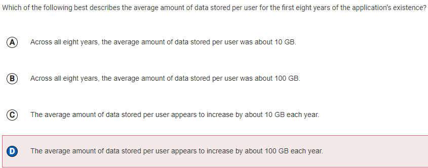
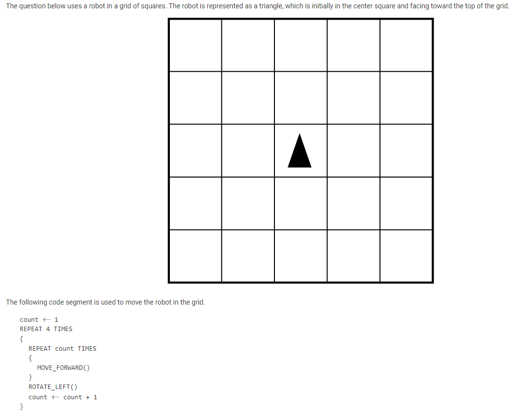

---
title: Finals Quiz 2 Corrections
layout: template
filename: FinalsQuiz2Corrections
--- 

## AP Computer Science Principles Finals-Quiz2 MCQ and Test Corrections:

### Karthik Valluri AP MCQ Practice Test Corrections:

|     |     |
| --- | --- |
|  | Question 12.  My answer:  C  Correct answer:  D  1.  This question is very simple and my answer made no sense, this was a blunder. 2.  Answer D is correct because crowdsourcing is the practice of obtaining input or information from a large number of people via the Internet. This application would benefit from the use of crowdsourcing the most, as the application could allow users to contribute descriptions and photographs of landmarks.. 3.  I can look through 5.4 and watch the daily videos to ensure that I have a full understanding and grasp of the topic. |
|  | Question 14.  My answer:  D  Correct answer:  A  1.  I was too sure on how to do this question at the time but looking back I think I was just too lazy to analyze all the data. 2.  Answer A is correct because the two line graphs are roughly the same shape. Each value on the right line graph is about 10 times the corresponding value on the left line graph. Therefore, the average amount of data stored per user is about 10 GB. 3.  I can look through 2.3 and watch the daily videos 1 and 2 to ensure that I have a full understanding and grasp of the topic. |
|  | Question 24.  My answer:  A  Correct answer:  C  1.  Answer A is clearly wrong because redundancy on the Internet allows packets to be transmitted along multiple paths, but does not reduce the number of packets needed to transmit a particular message.. 2.  Answer C is correct because if a particular device or connection on the Internet fails, subsequent data will be sent via a different route, if possible. This is supported by redundancy in the network. 3.  Daily Videos 1 and 2 from 4.2 describe this topic and are very useful resources to better understand this. |
|  | Question 27.  My answer:  C  Correct answer:  D  1.  Answer C is incorrect because the use of low-level abstractions is unrelated to the development process used.. 2.  Answer D is correct since incrementally adding code segments to correct, working programs can help programmers identify new errors that are introduced. 3.  Topic 1.3’s daily videos are a very useful resource as they are in-depth about this topic. |
|  | Question 40.  My answer:  B  Correct answer:  D  1.  Answer B is incorrect because citizen science is typically conducted with large groups of volunteers, rather than an individual citizen.. 2.  Answer D is correct since citizen science involves members of the general public participating in scientific research. Distributing the image analysis work to a larger group of individuals allows the work to be completed in less time.. 3.  I shouldn’t get a question like this wrong again as I have now ensured that I am clear on what citizen science is. |
|  | Question 43.  My answer:  B  Correct answer:  A  1.  Answer B is incorrect because the given code segment causes the robot to end in the lower-right corner of the grid, facing toward the top of the grid. This code segment causes the robot to rotate left before moving forward, causing the robot to follow a different path. The robot ends in the upper-right corner of the grid, facing toward the top of the grid.. 2.  Answer A is correct since the given code segment initializes count to 1 and increments count at the end of the outer loop. This causes the robot to move 1 square forward, then rotate left, then move 2 squares forward, then rotate left, then move 3 squares forward, then rotate left, then move 4 squares forward, then rotate left. The robot ends in the lower-right corner of the grid, facing toward the top of the grid. This code segment initializes count to 0 and increments count at the beginning of the outer loop. Because count is initialized to 0 and then immediately incremented inside the loop, the inner loop iterates the same number of times for each iteration of the outer loop as in the given code segment. The robot ends in the lower-right corner of the grid, facing toward the top of the grid. |
